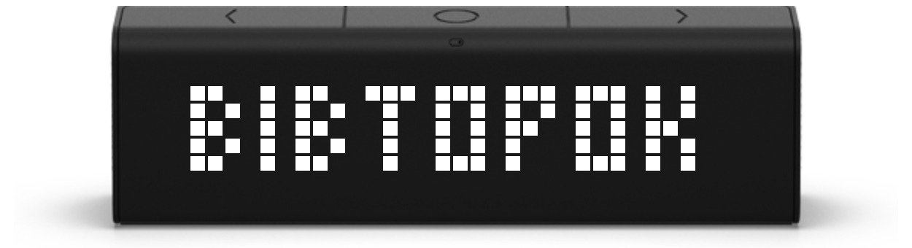

# Introduction

It is the backend for a [LaMetric app](https://apps.lametric.com/apps/%D0%B4%D0%B5%D0%BD%D1%8C_%D1%82%D0%B8%D0%B6%D0%BD%D1%8F/11056) that displays the current day of the week in the Ukrainian language. A small visual trick is used to make the text more readable — some letters are substituted with similar-looking digits, resulting in cleaner and less rounded characters.

The app can also signal Ukrainian national holidays such as Independence Day, Constitution Day, and others. There are two ways it does this:

- Letter coloring: one or more of the first letters of the day name are colored in the Ukrainian flag colors.
- Flag display: if the length of the day name allows enough space, a small Ukrainian flag is shown instead, making the color highlight unnecessary.


# Docker

Build image:
```bash
docker build \
  --build-arg TIMEZONE=$(grep ^TIMEZONE .env | cut -d '=' -f2) \
  -f Dockerfile.publish \
  -t ohorbatiuk/weekday .
```

Run container:
```bash
docker run -d -p 80:80 --name weekday-app ohorbatiuk/weekday
```
